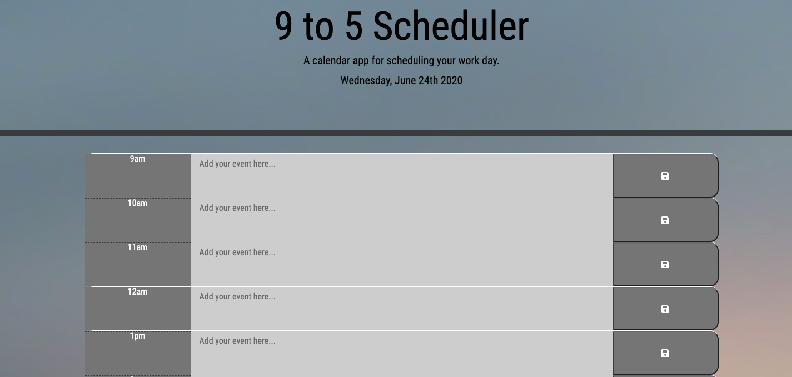

# Work Day Scheduler

Launch site: https://cmanthou.github.io/5.Work-Day-Scheduler/

Using Javascript, JQuery and APIs a Work Day Scheduler was created.  Events can be entered by hour and saved to local storage.  Current, Past and Future hour blocks are highlighted in different colors to help the user orient what time slots are current, past and future when selecting times to enter events. 

The Moment.js (https://momentjs.com/) library, Bootstrap (https://getbootsrap.com/) CSS code and Google Fonts (https://fonts.google.com/) library were utilized in writing this code.

Screenshot of site: 

