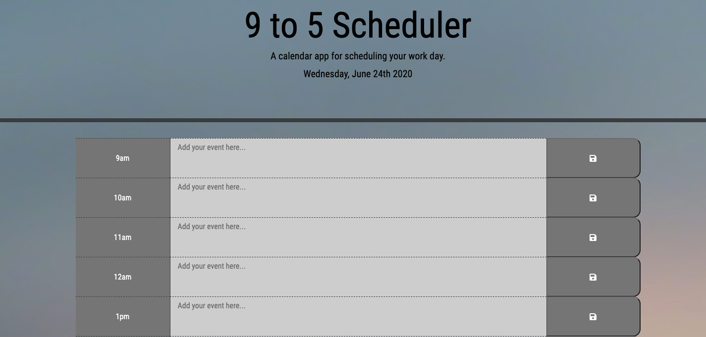

# Work Day Scheduler

Launch site: https://cmanthou.github.io/5.Work-Day-Scheduler/

Using Javascript and APIs a quiz game was created.  A timer is initiated set at 75 seconds and during that time, the user is asked 5 multiple choice questions.  Points are added for correct answers, but time is deducted (in 10 second incraments) for incorrect answers.  At the end of the quiz, scores are logged onto a high-score page and marked by user submitted initials.

Used normalize.css (v8.0.1) to make browsers render all elements more consistently and in line with modern standards.  Code pulled from https://necolas.github.io/normalize.css/

Screenshot of site: 

